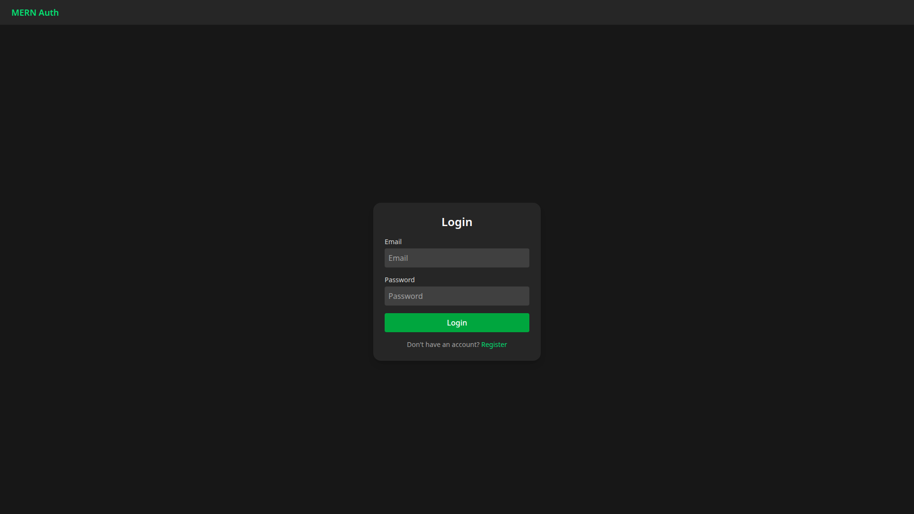
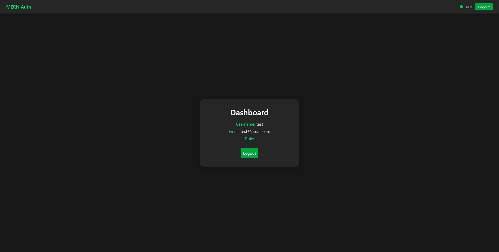

# 🔒 MERN Auth Template (Production-Ready)


A full-stack authentication boilerplate built with the MERN stack.  
Includes JWT auth, secure cookies, refresh tokens, email reset, and full Render + Vercel + Cloudflare deployment pipeline.

Use this template to instantly launch new full-stack apps with user auth out of the box.

🧩 **Use this as a template:** [Click here →](https://github.com/luka-marinicc/mern-auth-boilerplate/generate)

---

## 🚀 Live Demo

- **Frontend:** [https://mern-auth-luka.vercel.app](https://mern-auth-luka.vercel.app)  
- **Backend:** [https://mern-auth-api.onrender.com](https://mern-auth-api.onrender.com)

*Use test credentials or register a new account to try it out.*

---

## 🖼️ Screenshots

**Login Page**


**Dashboard (Role-based protected route)**



## 🧠 Tech Stack

| Layer | Tech |
|-------|------|
| **Frontend** | React + Vite + TypeScript + TailwindCSS + Axios |
| **Backend** | Node.js + Express + Mongoose + JWT |
| **Database** | MongoDB Atlas |
| **Auth** | Access & Refresh tokens + HttpOnly cookies |
| **Deployment** | Render (API) + Vercel (Client) |
| **Routing** | React Router + ProtectedRoute + AdminRoute |

---

## 🧱 Features

- 🔐 **JWT Access + Refresh Tokens**
- 🍪 **HttpOnly Secure Cookies** (`SameSite=None; Secure`)
- 👥 **Role-based Routes (User/Admin)**
- 🔄 **Automatic Token Refresh via Axios Interceptors**
- 🪪 **Persistent Login State**
- 🚪 **Protected & Public Routing**
- ⚙️ **Dynamic CORS (Dev ↔ Prod Switching)**
- ☁️ **Ready-to-Deploy Setup (Render + Vercel)**
- 🧩 **Clean Component Architecture + Context API**
- 🔁 **Password Reset via Email (Gmail SMTP)**
  - Users can request a password reset link via email.
  - Secure, time-limited token stored in MongoDB.
  - Reset form validates token and updates password.

---

## ⚙️ Quick Start (Local Dev)

### Step 1: Clone the repo
```bash
git clone https://github.com/luka-marinicc/mern-auth-boilerplate.git
cd mern-auth-boilerplate
```

### Step 2: Install dependencies
```bash
cd server && npm install
cd ../client && npm install
```

### Step 3: Configure environment
Copy example env files:
```bash
cp server/.env.example server/.env
cp client/.env.example client/.env
```

Edit with your details:
```bash
# server/.env
PORT=5000
NODE_ENV=development
MONGO_URI=***REMOVED***cluster.mongodb.net/authdb
JWT_SECRET=<long_random_hex>
ORIGIN_DEV=http://localhost:5173
ORIGIN_PROD=

# client/.env
VITE_API_BASE_URL=http://localhost:5000/api
```

### Step 4: Run locally
```bash
# Terminal 1
cd server && npm run dev

# Terminal 2
cd client && npm run dev
```

Visit → [http://localhost:5173](http://localhost:5173)

---
## ☁️ Deployment guide
### Backend (Render)
1. Create a new **Web Service**
2. Root Directory → `/server`
3. Build Command → `npm install`
4. Start Command → `npm start`
5. Environment Variables:
```bash
NODE_ENV=production
PORT=10000
MONGO_URI=<your Atlas URI>
JWT_SECRET=<same key>
ORIGIN_PROD=https://mern-auth-luka.vercel.app
```
6. Deploy and test:
```
https://your-render-app.onrender.com/health
```
### Frontend (Vercel)
1. New Project → Import GitHub repo
2. Root Directory → `/client`
3. Build Command → `npm run build`
4. Output Directory → `dist`
5. Environment Variable:
```bash
VITE_API_BASE_URL=https://your-render-app.onrender.com/api
```
6. Add `client/vercel.json`
```json
{
  "rewrites": [{ "source": "/(.*)", "destination": "/" }]
}
```

(prevents 404s on refresh)

7. Deploy → get live URL → update ORIGIN_PROD on Render → redeploy backend.

If `/health` returns `{ ok: true }`, deployment is working.

## 🧾 Post-Deployment Verification Checklist
| Test            | Expected                                   |
| --------------- | ------------------------------------------ |
| `/health`       | `{ "ok": true }`                           |
| `/auth/login`   | 200 OK + `Set-Cookie` header               |
| Cookie Flags    | `HttpOnly; Secure; SameSite=None`          |
| `/auth/refresh` | Auto refreshes token                       |
| Logout          | Deletes cookie + returns 401 on `/me`      |
| Browser         | `refreshToken` visible under Render domain |
| SPA Refresh     | Works (thanks to `vercel.json`)            |
| `/auth/forgot-password` | Returns 200 and sends email via Gmail SMTP |
| `/auth/reset-password/:token` | Updates password and invalidates token |


---

## 🧠 Future Upgrades

- ✅ Email verification

- 🧍 Profile management + avatar upload (Cloudinary)

- 🧩 Admin dashboard + user management

- ⚙️ CI/CD auto deploy (GitHub Actions)

## 🧑‍💻 Author
**Luka Marinič**

[GitHub](https://github.com/luka-marinicc) 

[LinkedIn](https://www.linkedin.com/in/luka-marinic)

---

## ⭐ **Star this repo** if you find it useful or plan to use it in your projects.

## 🏁 License
MIT © Luka Marinič